# Custom Widget #1 - The Terrible Widget
___

1)	Navigate to **\\\client\stemapp\widgets\samplewidgets**

2)	Make a copy of **CustomWidgetTemplate** and call it **TerribleWidget**.  This template will contain the more commonly used files in the widget file structure.

    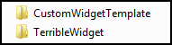

3)	Make sure you a have a preferred text editor installed on your machine.  There are many to choose from.  If you are unsure which to use start out use [NotePad ++](https://notepad-plus-plus.org/) for Windows, or [Atom](https://atom.io/) for Mac.

4)	The folder structure should look like this.  Let’s open up the **Widget.js** file.

    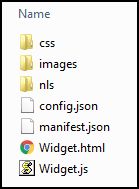
    
5)	Un-comment the following: 
    - **baseClass**:  change **jimu-widget-customwidget** to **jimu-widget-terriblewidget**. Note that JavaScript is case-                     sensitive. Also, add a comma at the end of this line.
    - **name:** un-comment this line and change to **‘Terrible Widget’**
   
    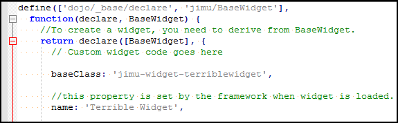
    
6)	Save the **Widget.js** file and close it.

7)	Open **Widget.html** in your text editor.  Copy the following HTML syntax (Change the name to your name or change the whole phrase if you so choose):

    ```
    <div>
        <div>Your name’s Terrible Widget</div>
    </div>
    ```

8)	Save the **Widget.html** and close it.

9)	Navigate to the **images** folder.  It will contain an image **icon.png** that is of a bookmark with width and height of 50x50.  Replace this icon with one of your own.  Have fun with it find something from free online sources like http://www.iconarchive.com/ , www.findicons.com, etc.  Use something from your phone if you want.  For best display results make the height and weight the same length preferably 50x50.  Example below:

    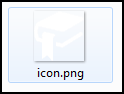        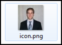   

10)	Add the widget information to the app config JSON file.  This is done by navigating to **\\\client\stemapp\sample -configs\config-demo.json** in the Web Appbuilder directory.  Find widgetPool -> widgets and add the following JSON to the end of it.  Make sure all required commas exist to insure proper JSON format.

    ```
    {
        "label": "Terrible Widget",
        "uri": "widgets/samplewidgets/TerribleWidget/Widget"
    }
    ```
    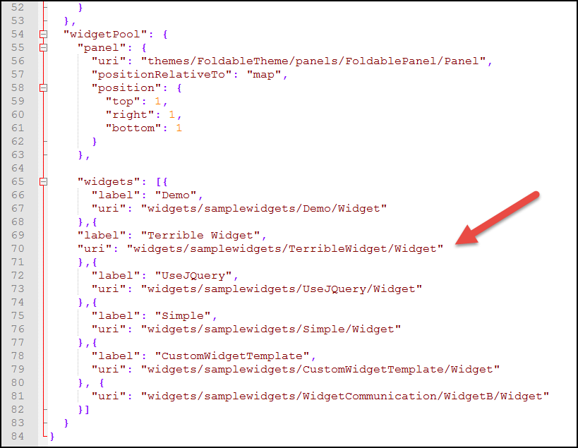
    
11)	At this point let’s test the widget to see your progress.  Test the widget via this path **http://[your host name:3344]/webappviewer/?config=sample-configs/config-demo.json**  Make sure you started your **startup.bat** file first.

12)	In the viewer, you should see a test button with your icon. Click on that button to verify your widget appears with the correct HTML.

    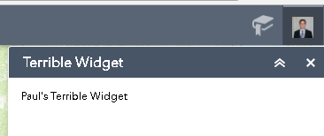

13)	What if you get an error like this???

    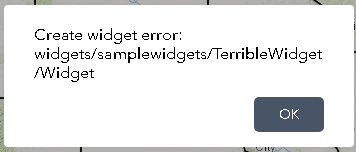
    
    In this case, there may be an error in your code syntax.  View your browsers developer tools by clicking **F12**.  Read the errors in the console to debug the error.
    
14)	Let’s change the color of the text with CSS.  Navigate to **\\\client\stemapp\widgets\samplewidgets\TerribleWidget\css\style.css**

15)	Add the following text to change the text to red.

    ```
    .jimu-widget-terriblewidget div:first-child{
        color: red;
    }
    ```
    
16)	Refresh the page at this path **http://[your host name:3344]/webappviewer/?config=sample-configs/config-demo.json.** The text should turn to red:

    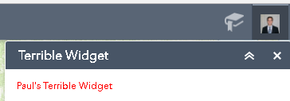
    
17)	Next let’s make the text configurable.  **\\\client\stemapp\widgets\samplewidgets\TerribleWidget\config.json**

18)	Add the following text to make to tool configurable.

    ```
    {
        "configText": "Your Name Awesome Widget!"
    }
    ```
    
19)	Open **Widget.html** file again and modify as seen here. 

    ```
    <div>
        <div>This is configurable. - ${config.configText}</div>
    </div>
    ```

20)	Test the widget again in the viewer.

    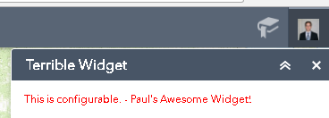
    
21)	Edit the **Manifest.json** file.  The name should match the name of your widget folder.  You can change the **author** and **description**.  Also, change the properties settings as seen below.

    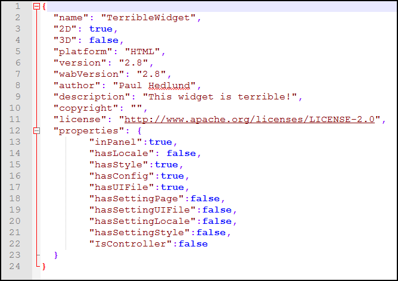
    
22)	Finally, to deploy this widget for use with an app place the entire folder in **\\\client\stemapp\widgets**

23)	Before the changes take effect you will need to restart your node session. To close your node session, close the startup.bat file and start a new node session by opening the startup.bat file.

24)	Once you’ve started a new node session, add a new widget and the new widget should appear in the list of available widgets.

    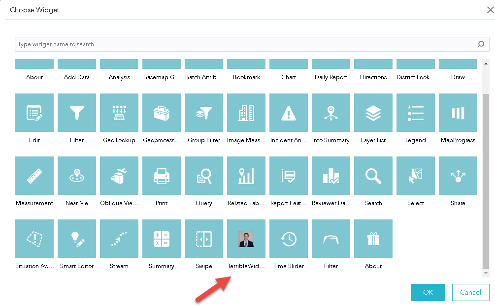
    
25)	For more information, check out Esri’s [Create a custom in-panel widge](https://developers.arcgis.com/web-appbuilder/sample-code/create-custom-in-panel-widget.htm) tutorial.
