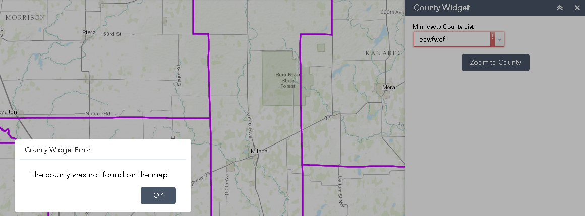

# Custom Widget #2 - Zoom to Minnesota County
___

1) Start by going through steps #1 to #13 in **The Terrible Widget** except call it the widget **CountyWidget**.  Select a different Icon as well.

2) Add AGO map to the sample config.  This is done by navigating to **\\\client\stemapp\sample-configs**. Open the **config-demo.json** file and go to **map -> itemId** and change the Web Map ID to 

    ```
    282b47baee24412c9e69537f699dcba2
    ```

    

3) This widget will not require some template files.  Therefore, remove the **config.json** file and **nls** folder.

    

4) Edit the **Manifest.json** file to not include some properties.  Have the parameters similar to what is seen below.

    
    
5) This widget will require some HTML syntax containing some DOJO/DIJIT widgets. First, remove any existing text in the **widget.html** file.  Then, copy the text below. 

    ```
    <div>
    <span class="sectionTitles">Minnesota County List</span>
    <div id="filterBlock">
      <table width="100%">
        <tr>
    <td class=tableAlignLeft><select dojotype="dijit/form/FilteringSelect" data-dojo-props="id:'MNcountylist', autoComplete:false, value:'', placeHolder: 'Select county ...'" required="false" />
    </tr>
          </table>
        </div>
        <div id="buttonBlock" style=”margin-top:10px;”>
          <table width=”100%”>
            <tr>
              <td style="text-align:center;"><div class="jimu-btn" data-dojo-attach-point="btnVote" data-dojo-attach-event="click:_ZoomCounty">Zoom to County</div></td>
            </tr>
          </table>
        </div>
    </div>
    ```
    
6) Now let’s spend some time adding code to the **widget.js** file.  This file will contain the most logic of any file for the widget.  First un-comment the **postCreate** and **startup** event functions.  Remove all other commented functions including **onOpen**, **onClose**, etc.  These events will not be used for this widget.

    
    
7) Part of the ArcGIS JavaScript API framework is something called AMD (Asynchronous Module Definition).  Part of the AMD process is adding ESRI libraries in the declarative process.  Add the following code to the top of the **widget.js** file underneath the ‘jimu/BaseWidget’ item in define.

    
    
    ```javascript
    'dijit/_WidgetsInTemplateMixin',
    'esri/graphicsUtils',
    'esri/graphic',
    'dojo/store/Memory',
    'esri/tasks/query',
    'esri/tasks/QueryTask',
    'esri/symbols/SimpleFillSymbol',
    'esri/symbols/SimpleLineSymbol',
    'dojo/_base/Color',
    'dijit/registry',
    'dijit/form/FilteringSelect',
    'jimu/dijit/Message',
    'dojo/on'
    ```

8) Then in the main function add the following.

    ``` 
    function(declare,BaseWidget,_WidgetsInTemplateMixin,graphicsUtils,Graphic,Memory,Query,QueryTask,
    SimpleFillSymbol,SimpleLineSymbol,ColorDojo,registry,FilteringSelect,Message,on)
    ```
    
9) Modify the declare line from **return declare([BaseWidget], {** to the text here below.

    ```
    return declare([BaseWidget, _WidgetsInTemplateMixin], {
    ```
    
10) The code at the top of the page should look like this.  Verify all commas and semicolons in the correct place.
 
     
     
11) There will be two more custom functions to add to the **widget.js** file. The first on is called **_GetProjectList**.   This will add all counties into a dropdown FilteringSelect dojo widget. Add the syntax below for this code.  It can be added after the **startup** function, like so:

    ```javascript
      startup: function() {
       this.inherited(arguments);
       this.mapIdNode.innerHTML = 'map id:' + this.map.id;
       console.log('startup');
      },
    ```
    
    After startup function add this:
 
     ```javascript
    _GetProjectList: function () {
        //Query the counties
        var item = "NAME";
        var queryTask = new QueryTask
        ("https://services2.arcgis.com/rwqARsO7kmPlpMQS/ArcGIS/rest/services/MNcounties/FeatureServer/0"); //service
        var query = new Query();
        query.where = "1=1"; //query to get all counties
        query.returnGeometry = false;
        query.outFields = [ item ];
        query.orderByFields = [ item ];
        queryTask.execute(query, getStoreQueryValues);

        //Loop through and store all MN counties in dropdown box
        function getStoreQueryValues(results){
            var data = {
                identifier: 'id', //This field needs to have unique values
                label: 'name', //Name field for display.
                items: []
            };

            var storeItem = new Memory({
                data: data
            });

            var itemStr = "";
            for (var i = 0; i < results.features.length; i++) {
                if(itemStr.indexOf(results.features[i].attributes[item]) == -1){
                    itemStr += "{id: '" + (i + 1) + "',name:'" + results.features[i].attributes[item] + "'},";
                    storeItem.put({'id': (i + 1),'name': results.features[i].attributes[item]});
                }
            }
            if (registry.byId("MNcountylist")) {
                registry.byId("MNcountylist").reset();
                registry.byId("MNcountylist").store = storeItem;
            }
        }
    },
    ```
    
12)	The second function, to be placed underneath the previous **_GetProjectList** function, is called **_ZoomCounty** and is the code that will zoom the map to the county and highlight it. 

    ```javascript
    //Function to zoom to county
    _ZoomCounty: function () {
        //Query the selected county
        var queryTask = new QueryTask("https://services2.arcgis.com/rwqARsO7kmPlpMQS/ArcGIS/rest/services/MNcounties/FeatureServer/0"); //service
        var query = new Query();
        query.where = "NAME = '" + registry.byId("MNcountylist").displayedValue + "'";	query.returnGeometry = true;
        query.outFields = ["NAME"];

        map = this.map;

        query.outSpatialReference = {
            wkid: 102100
        };
        on(queryTask, "complete", function(evt){
            zoomToResults(evt, map);
        });
        queryTask.execute(query, showSpatialResults);

        //Create graphic for zoom results
        function showSpatialResults(results){
            ClearSearchGraphics(map);
            var fieldsSelectionSymbol = new SimpleFillSymbol(SimpleFillSymbol.STYLE_SOLID,new SimpleLineSymbol(SimpleLineSymbol.STYLE_DASHDOT, new ColorDojo([255,255,0]), 6),new ColorDojo([255,255,0,0.35]));
            map.graphics.add(new Graphic(results.features[0].geometry, fieldsSelectionSymbol));
        }
        //zoom to the location of the result
        function zoomToResults(evt,map){
            var featureSet = evt || {};
            var features = featureSet.featureSet.features || [];
            if (features.length > 0) {
                var extent = graphicsUtils.graphicsExtent(features);
                if (extent) {
                    map.setExtent(extent.expand(1.5), true);
                }
            }
            else {
                new Message({message: 'The county was not found on the map!',titleLabel: "County Widget Error!",autoHeight: true});
            }
        }

        //clear previous search yellow polygon
        function ClearSearchGraphics(map){
            if (map.graphics) {
                map.graphics.clear();
            }
        }
    }
    ```
    
13) Then, in the **postCreate** event, located above the functions we just added, add the function call.
 
     ```javascript
    this._GetProjectList();
    ```
    
     
         
14) Now let’s test the display of the widget. Start the test URL again at **“http://[your host name:3344]/webappviewer/?config=sample-configs/config-demo.json”**.  Find the County Widget and test it.
  
     
          
15) Did you get this?  Use the developer tools via F12 to debug the error.  A missing comma or semicolon can cause the error.
  
     
          
16) The county list dropdown should contain a list of all Minnesota counties in alphabetical order.
  
     
       
17) Select a county and zoom to it by clicking **Zoom to County**.   The map should zoom to the county selected and highlight it in yellow.
  
     
       
18) Try entering an invalid county name.  A trapped error message should appear.
 
     
     
19) Now let’s clean up the styling a little bit by adding the following to the **style.css** file.  Add the following syntax to the file.
 
    ```
    #filterBlock{
      border-top: 3px solid;
      padding-top:10px;
    }

    #buttonBlock{
      margin-top:10px; 
    }

    #MNcountylist{
      width:190px;
    }

    #btnVote{
      width:175px;
      text-align:center;
    }
    ```
 
20) The change in the CSS should be as seen below.
 
    
     
    CSS:
    
      
     
21)	Finally, to deploy this widget for use with an app place the entire folder in **\\\client\stemapp\widgets**

22)	Before the changes take effect you will need to restart your node session. To close your node session, close the startup.bat file and start a new node session by opening the startup.bat file.

23)	Once you’ve started a new node session, add a new widget and the new widget should appear in the list of available widgets.

     
     
24)	That’s it!  If you have some time remaining play with modifying the widget.  Look into the ESRI libraries contained in the **widget.js** file.  Guides on this can be found on the [ArcGIS API for JavaScript](https://developers.arcgis.com/javascript/3/jsapi/) website.
