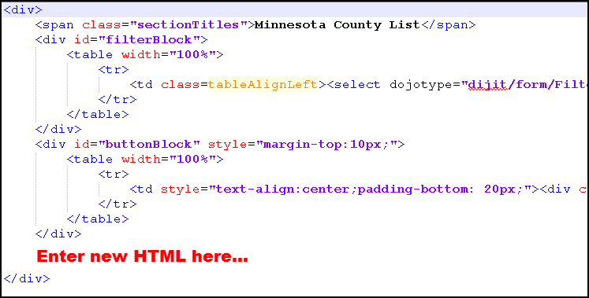
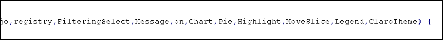
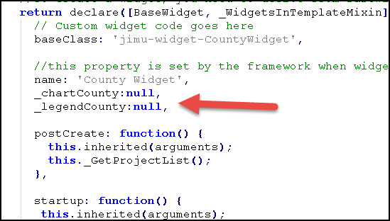
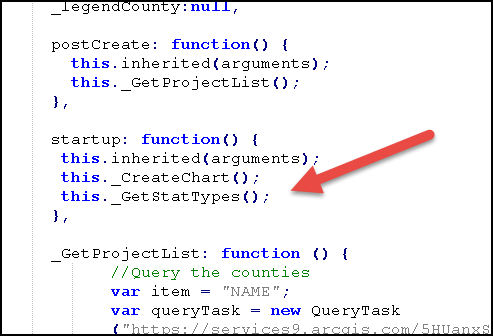
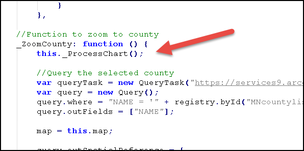
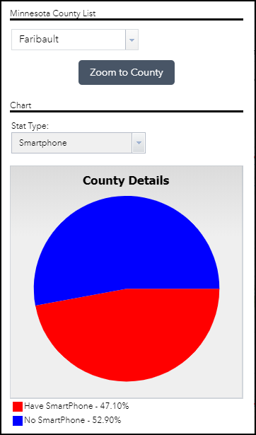

# Upgrade Widget #2 - Add Pie Chart
___

1) First complete "Custom Widget #2 - Zoom to Minnesota County" if you have not.

2) Add the chart control, new labels and styling to the **widget.html** file.

    

    ```
	<span>Chart</span>
	<div id="filterBlock">
		<table width="100%" style="margin-bottom:15px;">
			<tr>
				<td colspan=2>Stat Type:</td>
			</tr><tr>
				<td class=tableAlignLeft><select dojoType="dijit/form/Select" id="stattype" style="width:190px;" /></td>
				<td></td>
			</tr>
		</table>
		<div id="chartdiv">
			<div id="chartCounty" style="width: 330px; height: 330px;"></div>
			<div><div id="legendCounty"></div></div>	
		</div>
	</div>
    ```

3) The rest of the steps will involve editing the existing **widget.js** file.  Start by adding the dojo charting libraries.

    ```
	'dojox/charting/Chart', 
	'dojox/charting/plot2d/Pie', 
	'dojox/charting/action2d/Highlight',
    'dojox/charting/action2d/MoveSlice', 
	'dojox/charting/widget/Legend',
	'dojox/charting/themes/Claro'
    ```

4) Then in the main function add the following to the end of the function parameter list.

    ```
	,Chart,Pie,Highlight,MoveSlice,Legend,ClaroTheme
    ```
	
	
    
5) Add these two global variables near the top of the file.

    ```
	_chartCounty:null,
	_legendCounty:null,
    ```
	
	
	
6) At the end of the file add a new function for adding population and smart phone options to the stat type dropdown control.

    ```
	_GetStatTypes: function () {
		var select = registry.byId("stattype");

		option1 = { value: "Population", label: "Population", selected: true };
		option2 = { value: "Phone", label: "Smartphone", selected: false };

		select.addOption([option1,option2]);
	},
    ```

7)  Add the chart function that displays the chart and apply's its look.

    ```
	_CreateChart: function () {
		_chartCounty = new Chart("chartCounty",{title: "County Details",titlePos: "top",titleGap: 5,titleFont: "bold 12.5pt Tahoma",titleFontColor: "black"});
		_chartCounty.setTheme(ClaroTheme)
		 .addPlot("default", {
			type: Pie,
			stroke: {width: 0, color: "#D6B17E"},
			labels: false
		}).addSeries("chtSeriesCounty", [
			{y: 1, text: "N/A", color: "#f8cbad"}
		]);
		var anim_a1 = new MoveSlice(_chartCounty, "default");
		var anim_b1 = new Highlight(_chartCounty, "default");
		_chartCounty.render();
		_legendCounty = new Legend({chart: _chartCounty, horizontal: false}, "legendCounty");
	},
    ```

8) The last function to add contains the logic that will display results to the pie chart per county selected.  Please add this to the end of the javascript file.

    ```
	_ProcessChart: function () {
		if (registry.byId("MNcountylist").value === '') {
			new Message({message: "Please select a county first!",titleLabel: "Warning",autoHeight: true});
			return;
		}

		var queryTask = new QueryTask("https://services9.arcgis.com/5HUanxSG9RgDUEyy/arcgis/rest/services/MNcounties_WS2018_(1)/FeatureServer/0");
		var queryPrj = new Query();
		queryPrj.where = "NAME = '" + registry.byId("MNcountylist").displayedValue + "'";	
		queryPrj.returnGeometry = false;
		queryPrj.outFields = ["total_pop_percentage","med_age_percentage"];

		queryTask.execute(queryPrj,chartResults);
		function chartResults(results){
			if (registry.byId("stattype").value == 'Phone'){
				var percent_phone = results.features[0].attributes.med_age_percentage;
				var nophone = 1 - percent_phone;
				
				_chartCounty.updateSeries("chtSeriesCounty", [
					{y: percent_phone, text: "Have SmartPhone - " + (percent_phone * 100).toFixed(2).toString() + "%", color: "red"},
					{y: nophone, text: "No SmartPhone - " + (nophone * 100).toFixed(2).toString() + "%", color: "blue"}
				]);
			} else {
				
				var percent_pop = results.features[0].attributes.total_pop_percentage;
				var restofpop = 1 -percent_pop;

				_chartCounty.updateSeries("chtSeriesCounty", [
					{y: percent_pop, text: "Selected County - " + (percent_pop * 100).toFixed(2).toString() + "%" , color: "red"},
					{y: restofpop, text: "Rest of MN Population - " + (restofpop * 100).toFixed(2).toString() + "%", color: "blue"}
				]);
			}
			_chartCounty.render();
			_legendCounty.refresh();	
		};
	}
    ```
	
9) Add the **_GetStatTypes** and **_CreateChart** function inside the **startup** function as seen here.  Add a **this.** before the function.

	
	
10) Finally add the  **_ProcessChart** at the beginning of the **_ZoomCounty** function.  Add a **this.** before the function.

	
	
11) Upon completion test zooming to a county.  Try both **Population** and **Smartphone** stat type selections.  Your widget panel should look something like what is seen here.

	
	
12)	That’s it!  If you have some time remaining play with the widget by modifying the chart colors and styling.  Also, look into the ESRI libraries contained in the **widget.js** file.  Guides on this can be found on the [ArcGIS API for JavaScript](https://developers.arcgis.com/javascript/3/jsapi/) website.
